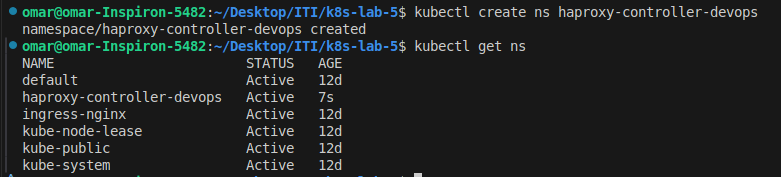
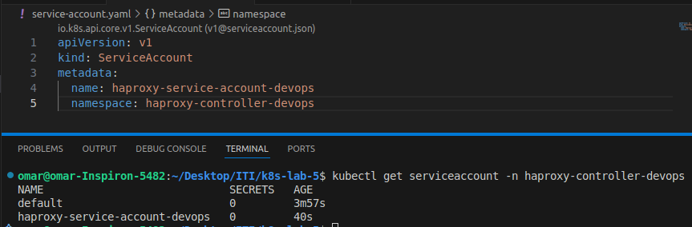
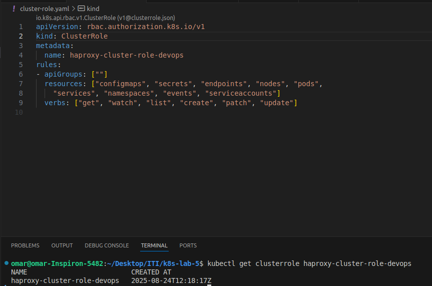
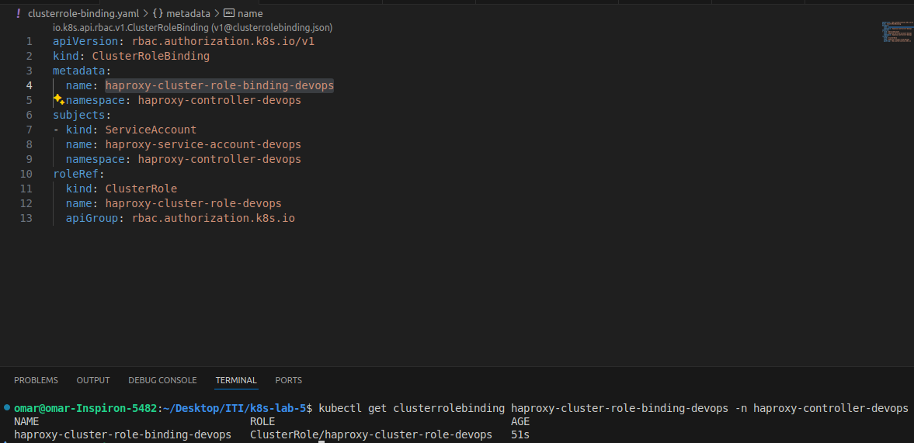
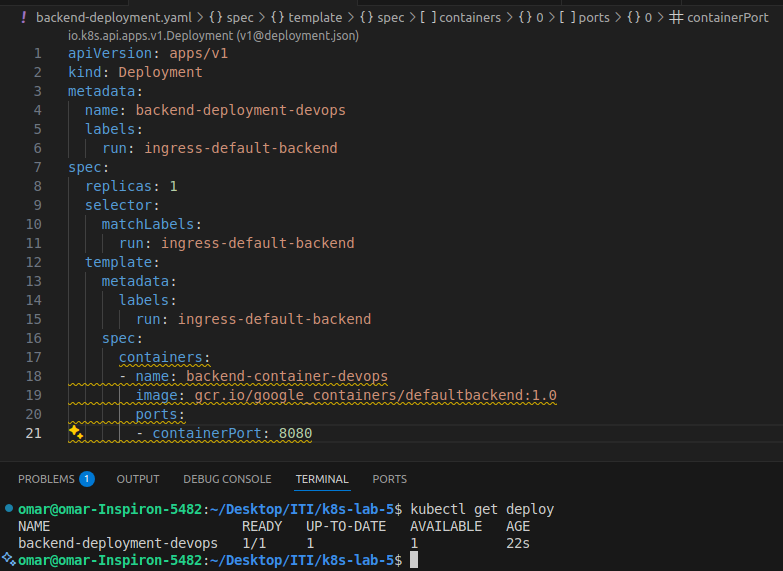
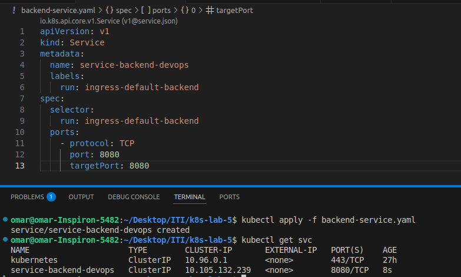

# Kubernetes Lab 5
This repository contains the tasks and solutions for setting up HAProxy Ingress with backend and frontend services, using Kubernetes RBAC and deployments.

---

## 1. Create a namespace `haproxy-controller-devops`

---

## 2. Create a ServiceAccount `haproxy-service-account-devops` under the same namespace

---

## 3. Create a ClusterRole `haproxy-cluster-role-devops`
Permissions: `get`, `list`, `watch`, `create`, `patch`, `update` on  
`configmaps`, `secrets`, `endpoints`, `nodes`, `pods`, `services`, `namespaces`, `events`, `serviceaccounts`.

---

## 4. Create a ClusterRoleBinding `haproxy-cluster-role-binding-devops`
- RoleRef → `rbac.authorization.k8s.io`, kind: `ClusterRole`, name: `haproxy-cluster-role-devops`  
- Subject → kind: `ServiceAccount`, name: `haproxy-service-account-devops`, namespace: `haproxy-controller-devops`

---

## 5. Create a backend Deployment `backend-deployment-devops`
- Labels: `run: ingress-default-backend`  
- Container: `backend-container-devops`  
- Image: `gcr.io/google_containers/defaultbackend:1.0`  
- Port: `8080`

---

## 6. Create a backend Service `service-backend-devops`
- Labels: `run: ingress-default-backend`  
- Selector: `run: ingress-default-backend`  
- Port: `8080`

---

## 7. Create a frontend Deployment `haproxy-ingress-devops`
- ServiceAccount: `haproxy-service-account-devops`  
- Image: `haproxytech/kubernetes-ingress`  
- Args: `--default-backend-service=haproxy-controller-devops/service-backend-devops`  
- Ports: `80 (http)`, `443 (https)`, `1024 (stat)`  
- Resources: `cpu: 500m`, `memory: 50Mi`  
- Liveness Probe: `/healthz` on port `1024`  
- Env:  
  - `TZ=Etc/UTC`  
  - `POD_NAME` → `metadata.name`  
  - `POD_NAMESPACE` → `metadata.namespace`

---

## 8. Create a frontend Service `ingress-service-devops`
- Type: `NodePort`  
- Selector: `run: haproxy-ingress`  
- Ports:  
  - `80 (http)` → nodePort: `32456`  
  - `443 (https)` → nodePort: `32567`  
  - `1024 (stat)` → nodePort: `32678`

---
